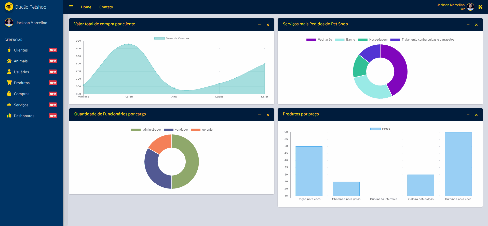
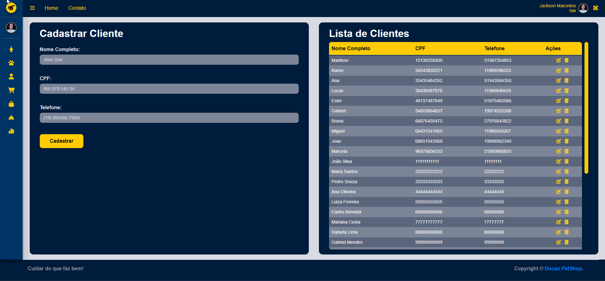

<h1 align="center">🐾Petshop Management System🐾</h1>

<h2 align="center">🎓Centro Universitãrio Adventista de São Paulo</h2>

  <h2>🧑🏻‍💻Sistemas de Informação Prof.: Alciomar Holanda Alunos: Jackson Freitas | Marilene D'ajuda | Henrique Palma</h2>

## 🔹LogUp Page

## 🔹LogIn Page

## 🔹Dashboard Page

## 🔹Tables Page

<h2 align="center">Tecnologies<h2>

🔹PHP🔹MySQL🔹JavaScript

